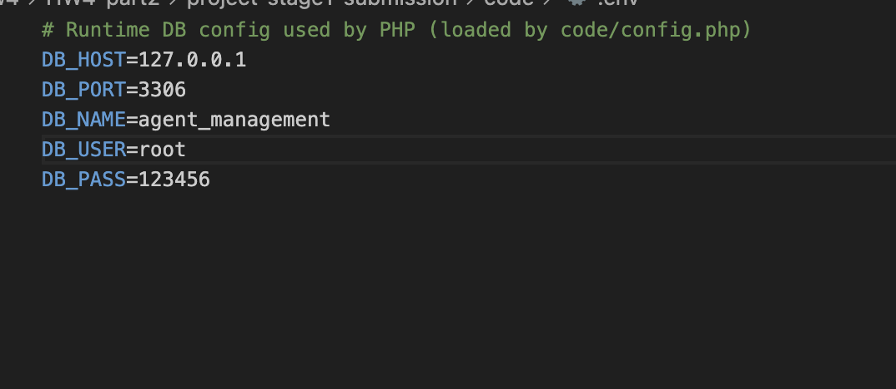
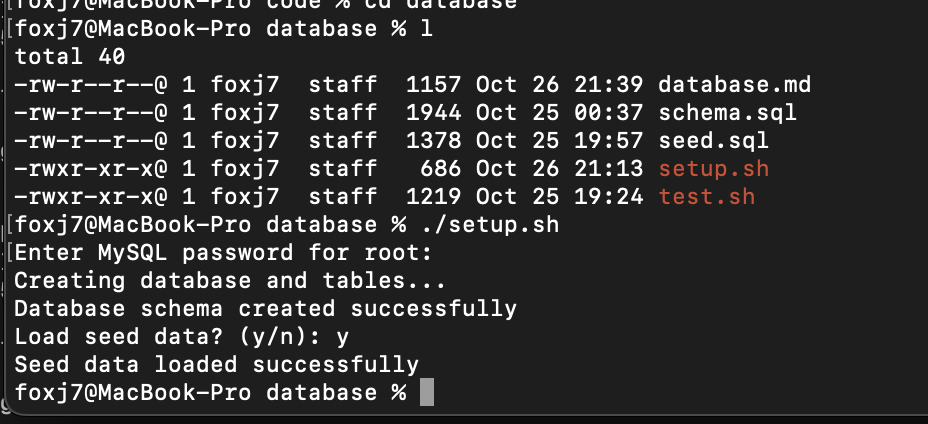
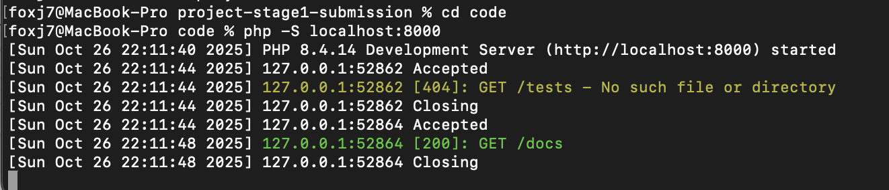
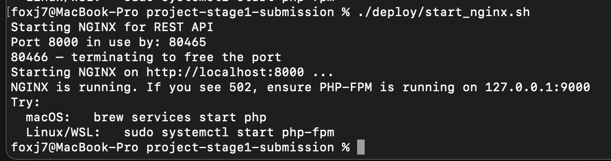
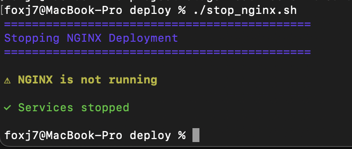
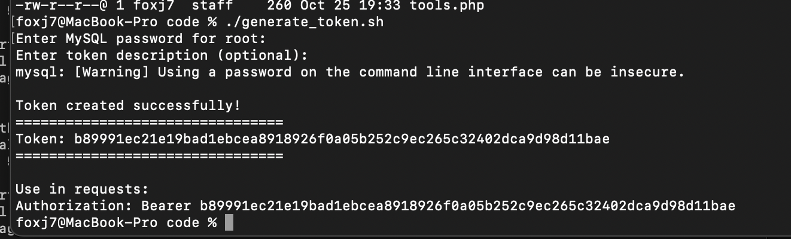
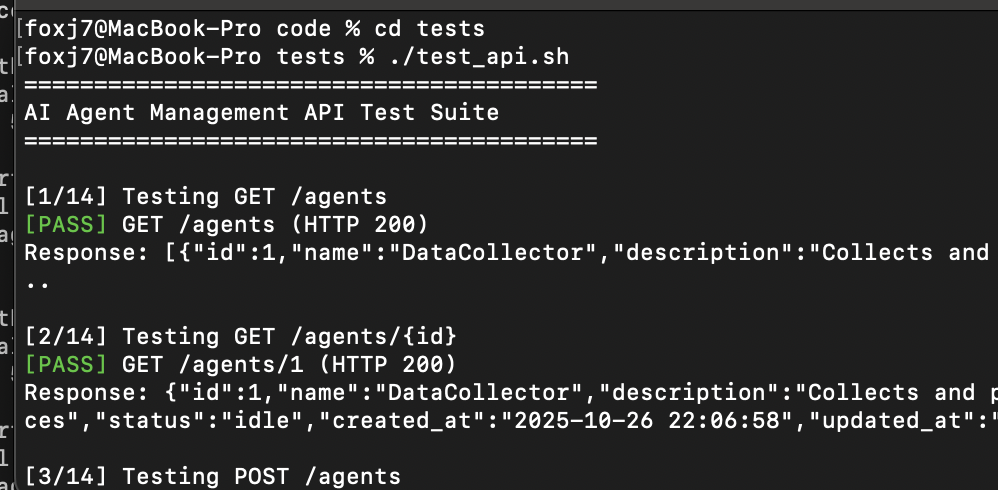
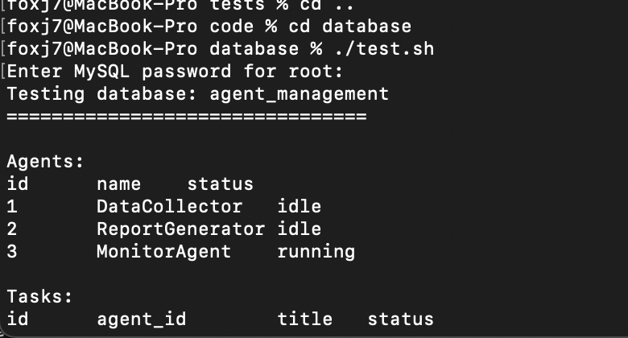
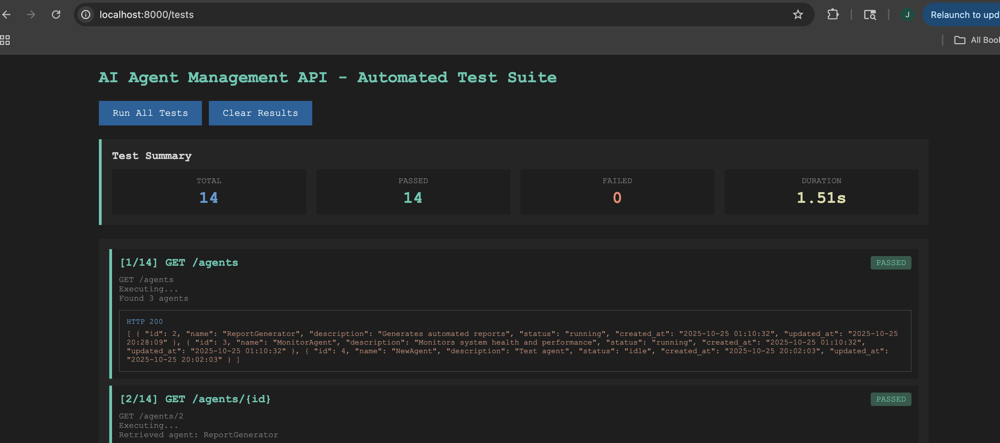
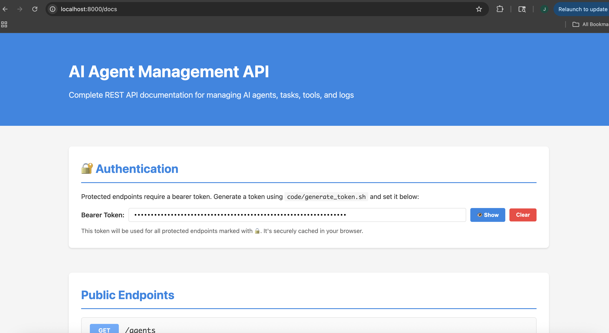

# Stage 1 REST API — Quick Guide

- PHP + MySQL backend with 14 endpoints (7 protected)
- Run locally via PHP built-in or NGINX script
- Includes docs page and two test suites

---

## Prerequisites

- PHP 8+, MySQL (or MariaDB)
- (Optional) NGINX + PHP-FPM
- VS Code (for editing), curl (for tests)

---

## 1) Configure Database (.env)

Create `code/.env`:

```env
DB_HOST=127.0.0.1
DB_PORT=3306
DB_NAME=agent_management
DB_USER=root
DB_PASS=123456
```

Tip: Keep this file local. Values above are for local dev only.



---

## 2) Initialize Database

From `code/database/`:

```bash
DB_HOST=127.0.0.1 DB_PORT=3306 DB_USER=root DB_PASS=123456 ./setup.sh
```

- Creates DB and tables, optional seed data



---

## 3) Start Server (PHP built-in)

From `code/`:

```bash
php -S localhost:8000
```

Visit:
- http://localhost:8000/docs



---

## 4) Start Server (NGINX script)

From project root:

```bash
./deploy/start_nginx.sh
```

- Auto-generates config, starts services if needed
- Visit http://localhost:8000/docs

Stop:
```bash
./deploy/stop_nginx.sh
```





---

## 5) Generate Auth Token

From `code/`:

```bash
./generate_token.sh
```

- Inserts token into DB
- Use “Authorization: Bearer <token>” in protected calls



---

## 6) Test — Shell Suite

From `code/`:

```bash
./tests/test_api.sh
```

- Runs cURL tests against all endpoints
- Shows HTTP codes and pass/fail





---

## 7) Test — Browser Suite

Open:

```bash
open code/tests/test.html       # macOS
# or
xdg-open code/tests/test.html   # Linux
```

- Click “Run All Tests”
- See per-endpoint results



---

## 8) Docs Page

- http://localhost:8000/docs
- Try endpoints interactively
- Paste the Bearer token for protected routes



---

## 9) Troubleshooting (Quick)

- DB errors: check `code/.env` values
- 502 in NGINX: ensure PHP-FPM is running
  - macOS: `brew services start php`
  - Linux/WSL: `sudo systemctl start php-fpm`
- Port busy: script frees 8000 automatically

---

## 10) What’s Included

- REST API (PHP) with MySQL (PDO)
- Auth via `api_tokens` table
- `./deploy/start_nginx.sh` + `./deploy/stop_nginx.sh`
- Docs page + two test suites

---

## Export & Submit

- Open this file in VS Code with Marp extension
- Export to PDF and commit both `.md` and `.pdf`
- Ensure README has quick-start and .env sample

---

## Endpoints Overview

- Agents: list, get, create, update, delete
- Tasks: list, get, create, update, delete
- Tools: list, create
- Logs: list

---

## Protected Endpoints (Bearer)

- POST/PUT/DELETE for Agents and Tasks
- POST Tools, Logs write endpoints
- Provide header: `Authorization: Bearer <token>`

---

## Sample Request (Protected)

Create Agent:

```bash
curl -X POST http://localhost:8000/agents \
  -H "Authorization: Bearer $TOKEN" \
  -H "Content-Type: application/json" \
  -d '{"name":"DemoAgent","description":"test"}'
```

---

## Sample Response

```json
{ "id": 1, "name": "DemoAgent", "status": "idle" }
```

---

## NGINX Config Anatomy

- listen 8000; root code/
- `try_files $uri /index.php?$args`
- fastcgi_pass 127.0.0.1:9000
- minimal, self-contained config

---

## PHP-FPM Quick Start

- macOS: `brew services start php`
- Linux/WSL: `sudo systemctl start php-fpm`
- Script auto-starts if not running

---

## Windows / WSL Note

- Recommended: WSL (Ubuntu) then follow Linux steps
- Native: nginx.exe + php-cgi.exe (not primary path)

---

## Schema Overview

- agents, tasks, tools, logs, api_tokens
- Foreign keys: tasks→agents, logs→(agents,tasks)
- Indexes on status and timestamps

---

## Seed Data (Optional)

- `./setup.sh` prompts to load seed.sql
- Provides sample agents/tasks/tools/logs

---

## DB Troubleshooting

- Access denied: check `DB_USER/DB_PASS`
- Unknown DB: run setup.sh
- Not running: start MySQL (brew/systemctl)

---

## Ports & Tips

- Default port: 8000 (script frees if busy)
- Use `php -S` for quick dev, NGINX for parity
